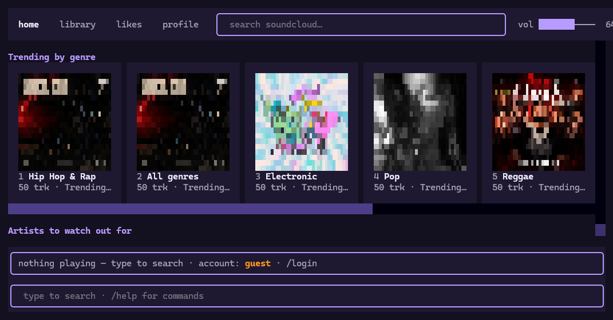
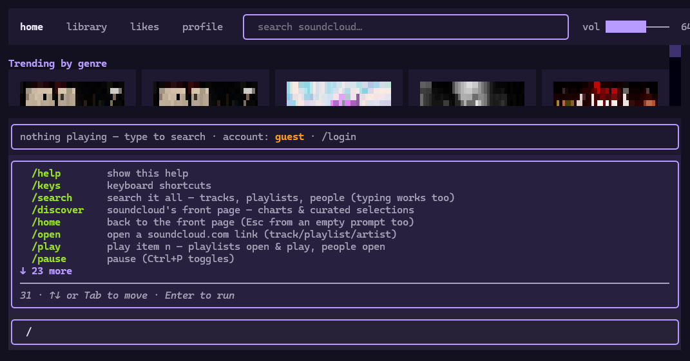

# klangtui

SoundCloud player in your terminal — search, play, like, playlists.

Sister project of [veltui](https://github.com/kfrttlw/veltui), built on the same trick:
a headless Firefox does the heavy lifting.



*Discover, in the terminal: real cover art drawn in glyphs, a top nav bar with a clickable
volume mixer, and everything one keystroke away.*

<details>
<summary>… and the <code>/</code> command palette</summary>



</details>

## Features

- **A top nav bar, like the site** — `home`, `library`, `likes`, `profile` buttons pinned
  across the top, a quick **search box** in the middle, and a clickable **volume mixer**
  (`vol ██████──── 80%` — click anywhere on the bar to set the level) on the right; click them,
  or keep using the commands. The active section is highlighted. A full command input (with
  history + `/` autocomplete) also sits at the bottom, under the player bar
- **The front page, in your terminal** — launching lands you on Discover: rows of square
  playlist cards with **real cover art**, drawn as crisp 2×2 quadrant "pixels" (twice the
  detail of plain half-blocks; `/pixels half` reverts). Scroll the rows sideways, like the
  site — and `/zoom +` / `/zoom -` make the cards bigger or smaller
- **Click the player bar to open the track** — the bottom bar opens a compact track page: a
  small cover on the left with the title, artist and transport buttons (prev · ▶/|| · next ·
  vol -/+ · like · radio) stacked to its right, the real waveform as a **clickable scrubber**
  with live `0:42 / 3:20` times across the full width below, and the rest of the track's
  details underneath. The whole top block stays on screen at any window size — even a tiny
  tiling-WM square — so seeking and skipping never need a scroll. It follows along: skip or
  auto-advance and the page re-syncs to the new track
- **Mouse or keyboard** — click any card or track to play it, or `Tab` into the page,
  arrows to move, `Enter` to play, `Esc` to go home. Every item is numbered too, so
  `/play <n>` always works
- **Search like the site** — playlist & people cards on top, track rows (with cover
  thumbnails) below; `/play <n>` plays a track, opens-and-plays a playlist, opens a
  person's tracks. Narrow it like the site's tabs: `/search tracks|playlists|people <text>`
- **The real waveform as the progress bar** — SoundCloud's signature scrubber, drawn in
  glyphs (`▂▅▇█▅…`), the played part lights up · plus a tiny equalizer dancing by the title
- **Audio comes out of a headless Firefox** — no mpv, no ffmpeg, nothing extra to install
- **Real SoundCloud login** — `/login` opens a normal Firefox window where you sign in on the
  real site (captchas, Google sign-in and SoundCloud's bot-check all just work because *you*
  do it); the session is then remembered between runs
- **Likes & playlists** — `/like`, `/likes`, `/playlists`, `/playlist <n>`, `/profile`
- **Radio** — `/radio` queues an endless run of tracks similar to what's playing
- **Queue** — `/next`, `/prev`, `/queue`, `/add <n>`, `/shuffle`, `/repeat off|all|one`,
  auto-advance when a track ends
- **Open links** — paste any `soundcloud.com` track/playlist/artist URL (or `/open <url>`)
- Full-screen [Textual](https://textual.textualize.io/) TUI — nav bar + volume mixer pinned on top,
  results scroll in the middle, the clickable player bar and the command input docked at the
  bottom
- **8 color themes** — ember, vinyl, neon, aurora, ocean, grape, mono, haze
  (`/theme` or `Ctrl+T` to cycle)
- **Command autocomplete** — type `/` for a live command menu; `Tab` (or `↑`/`↓`) to move
- **Input history** — `↑`/`↓` recall previous searches and commands, like a shell
- Persistent theme & volume preference (remembered between sessions)
- Works on Linux (Arch, etc.), macOS and Windows

## Install

Quick (installs klangtui + its deps + the `klangtui` command):

```bash
pip install git+https://github.com/kfrttlw/klangtui
klangtui
```

On the first run klangtui downloads its headless Firefox automatically (~80 MB),
so you don't have to. If you'd rather fetch it up front: `playwright install firefox`.

<details>
<summary>From source</summary>

Needs Python 3.10+.

```bash
git clone https://github.com/kfrttlw/klangtui
cd klangtui
python -m venv .venv

# Linux / macOS
source .venv/bin/activate
# Windows
.venv\Scripts\Activate.ps1

pip install -r requirements.txt
python klangtui/klangtui.py
```
</details>

## Usage

```bash
klangtui
```

With options:

```bash
klangtui --help
klangtui -q "aphex twin"   # search right after starting
klangtui --clear-data      # delete settings + the saved SoundCloud login
```

Inside the app, anything you type that isn't a command is a search.

## In-app commands

| command | description |
|---|---|
| `/help` | show all commands |
| `/keys` | keyboard shortcuts |
| `/search <text>` | search it all — tracks, playlists, people (typing works too) |
| `/search tracks <text>` | narrow the search: `tracks` · `playlists` · `people` |
| `/discover` | SoundCloud's front page — charts & curated selections |
| `/home` | back to the front page (`Esc` from an empty prompt too) |
| `/open <url>` | open a soundcloud.com link (track/playlist/artist) |
| `/play <n>` | play item n — playlists open & play, people open |
| `/play` | resume playback |
| `/pause` | pause (`Ctrl+P` toggles) |
| `/next` / `/prev` | move through the queue |
| `/queue` | show the queue (`/queue <n>` jumps) |
| `/add <n>` | add item n from the last list to the queue |
| `/seek <m:ss\|±s>` | seek — `/seek 1:30` · `/seek +15` |
| `/volume <0-100>` | set the volume (or click the mixer top-right) |
| `/radio [n]` | endless radio from the playing track (or item n) |
| `/shuffle` | shuffle the rest of the queue |
| `/repeat [mode]` | repeat: off · all · one (bare `/repeat` cycles) |
| `/np` | now-playing details (or click the player bar) |
| `/like [n]` | like the playing track (or item n) |
| `/unlike [n]` | remove a like |
| `/likes` | your liked tracks |
| `/playlists` | your playlists & albums |
| `/playlist <n>` | open playlist n |
| `/profile` | your profile |
| `/login` | sign in — opens a Firefox window, you log in on the real site |
| `/logout` | sign out |
| `/theme [n\|name]` | color themes (`Ctrl+T` cycles) |
| `/zoom [+\|-\|n]` | resize the playlist cards (`+` bigger · `-` smaller · `reset`) |
| `/pixels [quad\|half]` | artwork detail — crisp 2×2 quadrants (default) or simple blocks |
| `/clear` | clear the screen (`Ctrl+L`) |
| `/exit` | quit |

`:help` also works as an alias for `/help`.

## How it works

klangtui keeps a real soundcloud.com session in a headless Firefox (via
[Playwright](https://playwright.dev/python/)). The browser does three jobs:

1. **It holds the login.** `/login` opens a visible Firefox window on the same profile —
   you sign in on the real site (captcha / Google / 2FA / bot-check included), the cookies
   land in `~/.klangtui/profile`, and the session survives restarts.
2. **It authenticates the data.** Search, likes and playlists go through
   SoundCloud's own web API, sent from the browser's session with its own cookies —
   the same calls the website makes for itself.
3. **It plays the sound.** Tracks play inside an `<audio>` element in the headless
   browser, which still routes media through your normal audio output. That's why
   there is no mpv/ffmpeg dependency and the same code works on Arch, macOS and
   Windows.
4. **It decodes the artwork.** Cover images are scaled down on a `<canvas>` inside
   the same browser and come back as raw pixels, which the TUI paints with `▀`
   half-blocks — real cover art in the terminal, with no image library installed.

That's also why the first launch grabs a headless Firefox, and why the very first
search takes a moment — the browser is spinning up.

## Notes

- **No account needed to listen.** Search and playback work as a guest; `/login`
  is only for likes, playlists and your profile.
- **Go+ / HLS-only tracks.** klangtui plays the plain progressive streams the web
  player exposes. Tracks that only ship HLS (usually Go+ catalogue) are reported,
  not played — klangtui never tries to get around what the web player would allow,
  and Go+ previews stay previews.
- **Playback stops during `/login`** — the headless browser restarts to hand the profile
  to the visible window while you sign in.
- **Local data.** `~/.klangtui` holds your settings (theme, volume) and the Firefox
  profile with your SoundCloud cookies. It's your login — treat it like one.
  `--clear-data` (or `/logout`) gets rid of it.

## Disclaimer

klangtui is an unofficial, personal/educational project and is **not affiliated
with, endorsed by, or supported by SoundCloud**. It drives the public SoundCloud
web app in a local browser session — playback only, no downloading, no DRM
circumvention. Please use it responsibly, don't hammer the service, and read
SoundCloud's own terms if you depend on it.

## License

[MIT](LICENSE) © kfrt
