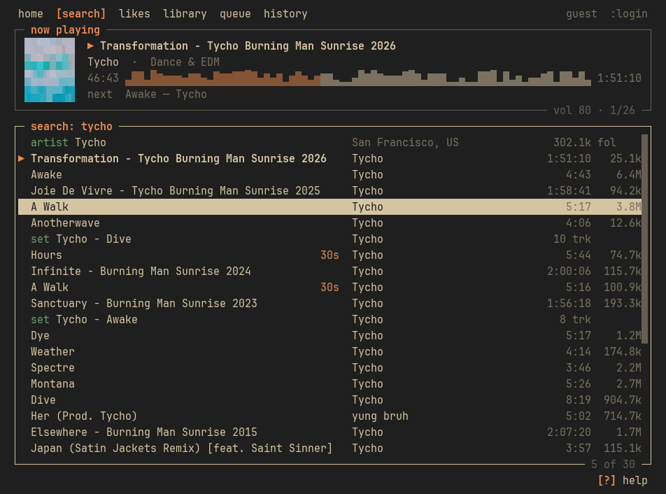
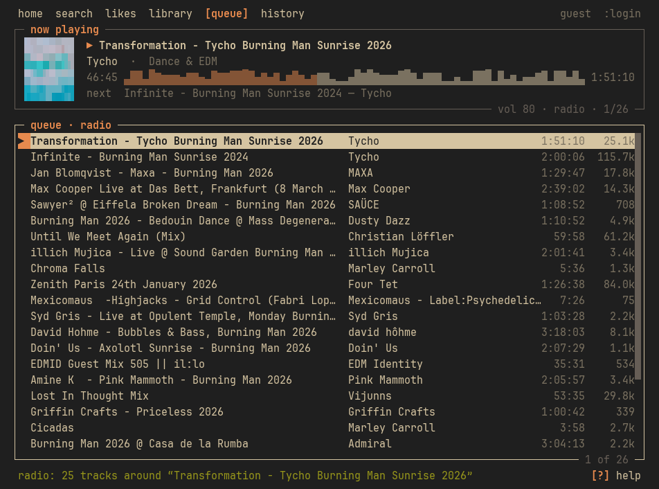
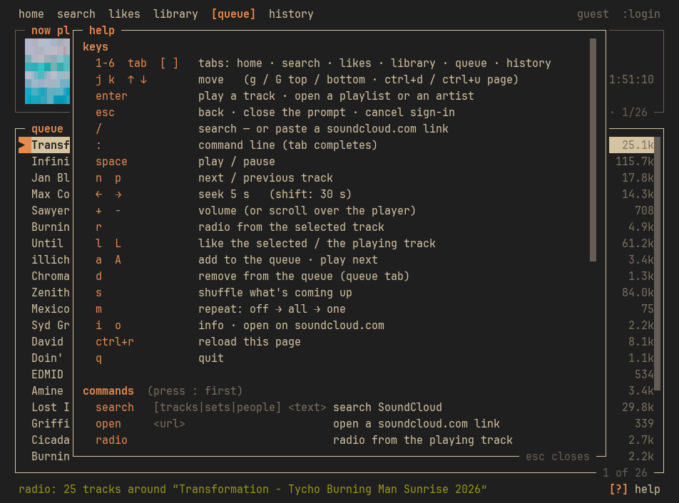

# klangtui

SoundCloud in your terminal — search, play, radio, likes, history.

Sister project of [veltui](https://github.com/kfrttlw/veltui).



*No themes: klangtui draws with your terminal's own 16 colours on your terminal's own
background (transparency included), so it looks like whatever your terminal does.*

<details>
<summary>… the radio, and the <code>?</code> help</summary>




</details>

## Features

- **Looks like your terminal** — thin boxes, titles in the frame, `[tab]` on top,
  `[?] help` at the bottom; the colours are your terminal's ANSI palette, the
  background is its background. Change your kitty / alacritty / foot theme and klangtui
  follows
- **Keyboard first, like lazygit** — `j`/`k` to move, `enter` to play, `space` to
  pause, `n`/`p` to skip, `/` to search, `:` for commands, `?` for help, `1`–`6` for the
  tabs. The mouse works too: click a tab, click a row twice, click the waveform to seek,
  scroll over the player for volume
- **Radio that doesn't repeat itself** — built from the track's *station* (what the
  site's Station button plays) and its related tracks, seeded from the last few songs you
  actually listened to, at most two tracks per artist, nothing you've heard in the last
  three days, no 30-second previews. It tops itself up as it plays
- **Autoplay** — when the queue ends, the radio carries on with something similar
  (`:autoplay off` to stop at the end instead)
- **Remembers you** — every play goes into a local history (the `history` tab); the queue
  and the position you quit at come back next time (`space` resumes); search and
  command history survive restarts; your likes are known from the start
- **The real waveform** as the scrubber, a small **cover** next to it, and the next
  track underneath
- **30-second Go+ previews are marked** (`30s`) before you press play
- **Likes & playlists** — `likes` and `library` tabs, `l` to like, `L` for the playing track
- **Paste a link** — `/` + any soundcloud.com track / playlist / artist URL opens it
- **Light** — no browser in the background: plain HTTPS for SoundCloud, mpv for sound.
  The app itself sits around 50 MB

## Install

klangtui plays audio through **mpv**:

```bash
sudo pacman -S mpv        # Arch
sudo apt install mpv      # Debian / Ubuntu
brew install mpv          # macOS
```

Then klangtui itself:

```bash
pip install git+https://github.com/kfrttlw/klangtui
klangtui
```

<details>
<summary>From source</summary>

Needs Python 3.10+.

```bash
git clone https://github.com/kfrttlw/klangtui
cd klangtui
python -m venv .venv
source .venv/bin/activate
pip install -r requirements.txt
python -m klangtui
```
</details>

Linux and macOS. (Windows isn't supported yet — klangtui talks to mpv over a Unix socket.)

## Usage

```bash
klangtui
klangtui -q "aphex twin"   # search right after starting
klangtui --clear-data      # delete settings, history and the saved login
```

### Keys

| key | does |
|---|---|
| `1`–`6` · `tab` · `[` `]` | tabs: home · search · likes · library · queue · history |
| `j` `k` · `↑` `↓` | move (`g` / `G` top / bottom, `ctrl+d` / `ctrl+u` page) |
| `enter` | play a track · open a playlist or an artist |
| `esc` | back · close the prompt · cancel sign-in |
| `/` | search — or paste a soundcloud.com link |
| `:` | command line (`tab` completes) |
| `space` | play / pause |
| `n` `p` | next / previous track |
| `←` `→` | seek 5 s (`shift`: 30 s) |
| `+` `-` | volume |
| `r` | radio from the selected track |
| `l` `L` | like the selected / the playing track |
| `a` `A` | add to the queue · play next |
| `d` | remove from the queue (queue tab) |
| `s` | shuffle what's coming up |
| `m` | repeat: off → all → one |
| `i` `o` | info · open on soundcloud.com |
| `ctrl+r` | reload the page |
| `q` | quit |

### Commands

| command | does |
|---|---|
| `:search [tracks\|sets\|people] <text>` | search, optionally narrowed |
| `:open <url>` | open a soundcloud.com link |
| `:radio` | radio from the playing track |
| `:like` · `:unlike` | like / unlike the playing track |
| `:volume <0-100>` · `:seek <m:ss\|±s>` | volume · jump within the track |
| `:repeat off\|all\|one` | repeat mode |
| `:autoplay on\|off` | keep playing similar music when the queue ends |
| `:previews on\|off` | let the radio queue 30-second Go+ previews |
| `:cover on\|off` | the cover in the player |
| `:shuffle` · `:clear` | shuffle what's next · empty the queue |
| `:history clear` | forget your listening history |
| `:login` · `:logout` | sign in / out |
| `:help` · `:quit` | |

## How it works

- **SoundCloud over plain HTTPS.** klangtui makes the same api-v2 calls the website
  makes. The public `client_id` is read from soundcloud.com's own page (and swapped for a
  fresh one by itself when SoundCloud rotates it). Connections are kept alive and
  reused; a hiccup is retried once.
- **Sound through mpv.** One mpv process, no window, driven over its JSON IPC socket
  (in a private directory). mpv pushes position / pause / end-of-track events, so
  nothing is polled. It plays the plain mp3 stream when there is one and SoundCloud's
  HLS (AAC) otherwise — the same streams the web player uses.
- **A browser only to sign in.** `:login` opens a normal Firefox window (via
  Playwright) where you sign in on the real site — captcha, Google sign-in and 2FA just
  work because *you* do it. klangtui keeps the session token and closes the browser. If
  SoundCloud's bot-check ever refuses a like, the like is retried once from a short-lived
  headless Firefox.
- **Everything it remembers** lives in `~/.klangtui`: `db.sqlite` (settings, history,
  queue, likes), `token` (your sign-in, readable only by you) and `profile` (the sign-in
  browser's profile).

## Notes

- **No account needed to listen.** Search, radio and playback work as a guest;
  `:login` adds likes, your playlists and your profile.
- **Go+ tracks** play as the 30-second previews SoundCloud gives every non-subscriber —
  klangtui never tries to get around what the web player allows.
- **Signed in with klangtui 0.1?** Your login is picked up from the old profile
  automatically.

## Disclaimer

klangtui is an unofficial, personal/educational project and is **not affiliated
with, endorsed by, or supported by SoundCloud**. It uses the public SoundCloud web API
the way the website does — playback only, no downloading, no DRM circumvention. Please
use it responsibly, don't hammer the service, and read SoundCloud's own terms if you
depend on it.

## License

[MIT](LICENSE) © kfrt
